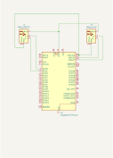
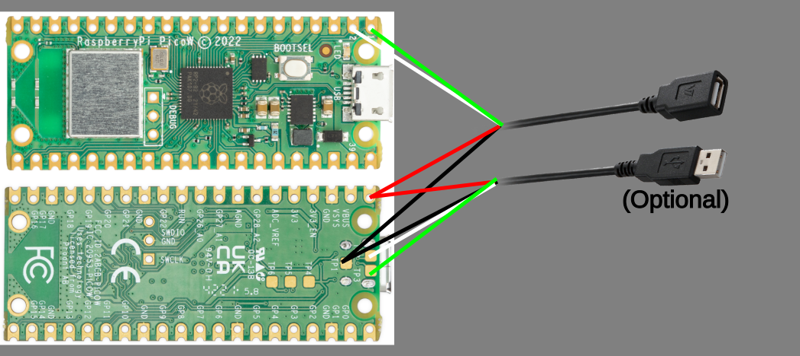

# Pico BLE HID

This project uses a Raspberry Pi Pico W as a Bluetooth Low Energy adapter for
a wired USB HID input peripheral, allowing it to connect to a host device
over BLE using HID over GATT Profile.

## Setup

[YouTube Video](https://youtu.be/YuHbTrccshw)

### Hardware

You will need the following hardware to make the device:
- Raspberry Pi Pico W
- USB extension cable
- (Optional) Momentary push button

You will need to cut the USB extension in half and connect the wires from the
female end to the Raspberry Pi Pico W. The default configuration is to attach
the USB's green wire to pin 1/GP0 and USB's white wire to pin 2/GP1. You will
also need to connect the red to 5V VBUS/VSYS (since you'll be powering from the
USB connection, VBUS should be fine) and the black to any ground pin. Pin 38
is the closest and most convenient, or the ground test point TP1 on the back
will also work. While you can connect the Raspberry Pi Pico to the host device
using the micro USB port and a micro USB cable, since you have already
sacrificed half of the USB extension cable, you might as well use the male half
to create a standard USB-A connection.  If you wish to do so, then simply 
connect the red and black wires of the male connector end to VBUS (5V) and GND,
respectively. For the data wires, you can solder them to the two test points
TP2 and TP3 on the back of the Raspberry Pi Pico. The white cable goes to TP2
and the green cable to TP3.

Optionally, a momentary push button can be wired to GP5 and GND to switch between Bluetooth and USB passthrough mode.

The individual wires on the USB can be fragile, so hot glue or other strain
relief is a good idea.

### Software

Download the ble_hid.uf2 file from the latest
[release](https://git.kkozai.com/kenji/pico_ble_hid/releases) and flash
onto the Raspberry Pi Pico W by holding down the BOOTSEL button while plugging
into your computer so that it appears as a USB drive, then transfer the
firmware file onto the Pico W. After unmounting, the firmware install is
complete.

## Usage

Connect the Raspberry Pi Pico W into any USB power source (a good, small power
bank will work), then plug in the desired peripheral into the female USB
socket. After about a second, the onboard LED will light up, indicating it is
ready to be paired over Bluetooth LE.

From the host machine, go to your Bluetooth settings and pair with the
"Pico BLE HID" device. The LED should turn off when pairing begins, and it will
turn back on when pairing is complete and the Raspberry Pi Pico W is
ready to receive inputs. This will take a few seconds, so be patient.
Once the light is back on, your device should work over the Bluetooth
connection. When connecting a power-hungry device such as a gaming keyboard
with many LEDs, the sudden power draw when plugging in can cause issues, so it
is recommended to turn off the LEDs before connecting to the Raspberry Pi Pico
W.

If you connected a push button to GP5, then pressing the button will switch
between Bluetooth connection mode and USB passthrough mode. In USB passthrough
mode, the inputs will be passed through from the host to the USB connection made
through the test points or the Micro USB port.

In principle, the Pico BLE HID will work with peripherals plugged into
a USB hub, but compatibility will vary with the specific hardware used,
including the peripherals, USB hub, and operating system. This is because the
HID report descriptors for all interfaces on all devices are combined into a
single descriptor, which has a limitation of 512 bytes. Additionally, some OSes
may get confused with combinations of report descriptors that seemingly
conflict. This is particularly true with modern gaming peripherals which will
present as multiple interfaces of different types (e.g. a keyboard may present
as a combined keyboard, mouse, joystick, and consumer control, even if it does
not use any of the features of the other peripheral types), which can conflict
when another peripheral of one of those other types is plugged in. This also
uses up precious bytes of the limited space available for HID descriptors
over GATT. Powering multiple USB devices can also cause problems -- a powered
USB hub *may* help, but it is largely untested.

## Licensing

This software is distributed under the
[GNU Lesser General Public License Version 3](LICENSE), with the exception of
the libraries in the following section.

## Credits

The project uses code from the following sources:
- [BTstack](https://github.com/bluekitchen/btstack/) for code from 
  [hog_keyboard_demo.c](https://github.com/bluekitchen/btstack/blob/master/example/hog_keyboard_demo.c)
  and
  [hog_keyboard_demo.gatt](https://github.com/bluekitchen/btstack/blob/master/example/hog_keyboard_demo.gatt) distributed under their
  [non-commercial license](https://github.com/bluekitchen/btstack/tree/master?tab=License-1-ov-file)
  and the
  [supplemental license](https://github.com/raspberrypi/pico-sdk/blob/master/src/rp2_common/pico_btstack/LICENSE.RP)
  from Raspberry Pi
- [Pico-PIO-USB](https://github.com/sekigon-gonnoc/Pico-PIO-USB/) for templates
  used from the [host_hid_to_device_cdc](https://github.com/sekigon-gonnoc/Pico-PIO-USB/tree/control-keyboard-led/examples/host_hid_to_device_cdc)
  example released under the MIT license
- [Raspberry Pi Pico SDK Examples](https://github.com/raspberrypi/pico-examples)
  for a modified version of
  [pico_w/bt/standalone/btstack_config_common.h](btstack_config_common.h)
  distributed under the BSD-3-Clause license
- [TinyUSB](https://github.com/hathach/tinyusb) for templates used in
  [tusb_config.h](tusb_config.h) distributed under the MIT license
